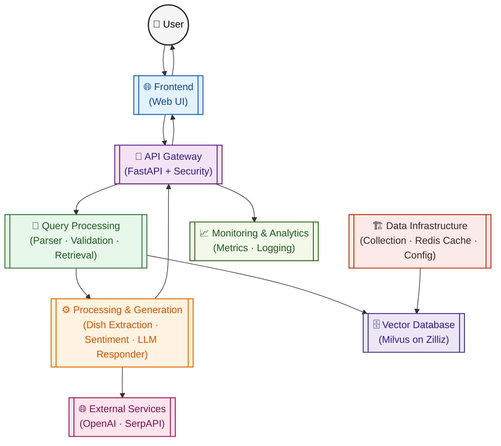

# System Design

```mermaid
flowchart TB
  %% USER
  U(("👤 User"))

  %% LAYERS
  FE[["🌐 Frontend<br/>(Web UI)"]]
  API[["🚪 API Gateway<br/>(FastAPI + Security)"]]
  QP[["🧠 Query Processing<br/>(Parser · Validation · Retrieval)"]]
  GEN[["⚙️ Processing & Generation<br/>(Dish Extraction · Sentiment · LLM Responder)"]]
  VDB[["🗄️ Vector Database<br/>(Milvus on Zilliz)"]]
  DINF[["🏗️ Data Infrastructure<br/>(Collection · Redis Cache · Config)"]]
  EXT[["🌐 External Services<br/>(OpenAI · SerpAPI)"]]
  OBS[["📈 Monitoring & Analytics<br/>(Metrics · Logging)"]]

  %% FLOW
  U --> FE --> API --> QP --> GEN --> API --> FE --> U
  QP --> VDB
  DINF --> VDB
  GEN --> EXT
  API --> OBS

  %% STYLING
  classDef user fill:#f5f5f5,stroke:#212121,stroke-width:2px,color:#000
  classDef frontend fill:#e3f2fd,stroke:#1565c0,stroke-width:1.5px,color:#0d47a1
  classDef api fill:#f3e5f5,stroke:#6a1b9a,stroke-width:1.5px,color:#311b92
  classDef query fill:#e8f5e9,stroke:#2e7d32,stroke-width:1.5px,color:#1b5e20
  classDef gen fill:#fff3e0,stroke:#ef6c00,stroke-width:1.5px,color:#e65100
  classDef vdb fill:#ede7f6,stroke:#4527a0,stroke-width:1.5px,color:#311b92
  classDef infra fill:#fbe9e7,stroke:#bf360c,stroke-width:1.5px,color:#3e2723
  classDef ext fill:#fce4ec,stroke:#ad1457,stroke-width:1.5px,color:#880e4f
  classDef obs fill:#f1f8e9,stroke:#33691e,stroke-width:1.5px,color:#1b5e20

  class U user
  class FE frontend
  class API api
  class QP query
  class GEN gen
  class VDB vdb
  class DINF infra
  class EXT ext
  class OBS obs
```
